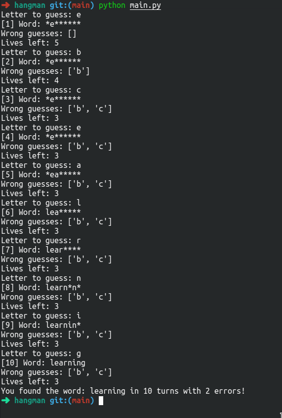

# Hangman
Simple Hangman game in the terminal, written in Python.


## Installation

This project uses pure Python. You can download Python [here](https://www.python.org/downloads/) for your specific platform.

Then, just clone the project using
```bash
git clone https://github.com/tcrasset/hangman.git
```

## Usage

Navigate inside your recently cloned directory and simply run
```
python main.py
```

## Interface



*Tom Crasset, 7/01/2021, MIT License*
